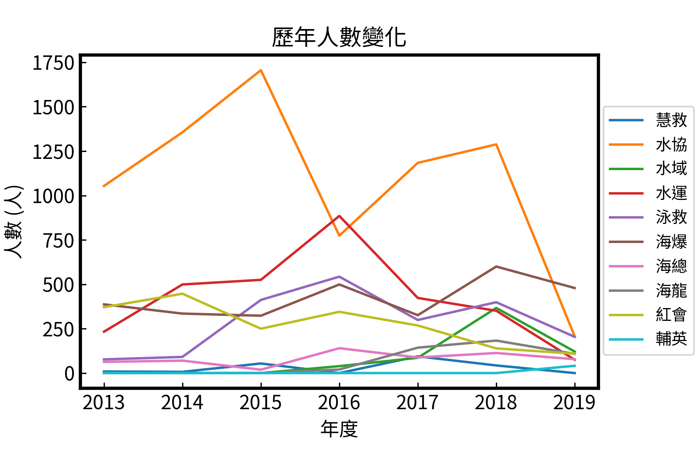
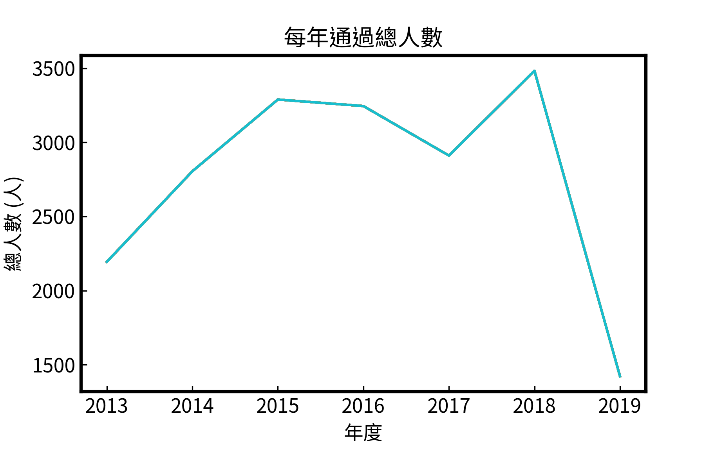

# Lifeguard Analysis 2020

此專案為統計體育署游泳池救生員合格人數，並比較不同團體通過人數之差異。

資料取自[教育部體育署救生員授證資訊網站 - 救生員資料庫](http://www.lifeguard.utaipei.edu.tw/D01.php)

目前合格的救生員中仍以水上救生協會為最大宗，其次是水中運動協會、海爆協會、紅十字會等等。

除了各種協會外，去年輔英科技大學也通過41人。

